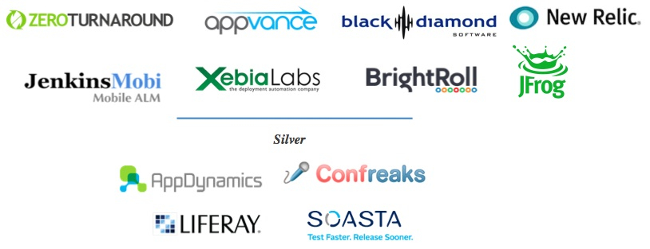

# GitHub Pull Request Builder  Workflow
   

#Will Soula
##Drilling Info  
###http://drillinginfo.com 

####@jenkinsconf

---

# GHPRB Workflow

- Where is it in the SDLC?
    - Starts and ends in the dev part of the SDLC
    - Small little CI loop
- What is the workflow?
    - Create your feature branch and begin work
    - Upon first commit or after tests committed open pull request
    - Continue pushing to your feature branch as normal
    - Profit from CI on a dev branch
- How to keep pull request from being accepted too soon
    - Put pull request in review card
    - Denote it is in progress in the title

---

# How To Test Codebase

- Monolithic
    - All code in one repo
    - Run like normal build
- Modules and sub-modules
    - If tests are in same repo
        - Pass sha and refspec
        - Run down stream tests against them
    - If running downstream tests
        - Publish to different location
        - Pass to repository manager (bower, ivy, maven, etc)

---

# Beyond Tests

- Deployment of documentation
    - Why
        - People without access to github
        - People not tech savvy
    - How
        - Do doc build
        - If it is a pull request figure out the pull request number
            - Change the deploy location
            - Deploy to "pr" folder
        - Deploy as normal
        - If last commit was a pull request, delete the pull request deploy

---

#Beyond Tests

- Customer demos, both internal and external
    - Deploy your latest code continuously so other dev can work on consuming your latest code (dual agile), instead of waiting for one to finish before other starts
    - If using monolithic codebase can deploy what is coming next to a site for consumption and feedback on the beta
- Comment in pull request buid number deployed in, but only if already commented
    - Get pull request number from last git message
    - Use that to comment on pull request using github api

---

# Problems

- Self signed ssl
    - GitHub enterprise
    - Older Jenkins/git
    - Upgrade of git plugins gave better logging
- Incorrect urls
    - place 1
    - place 2
- Advanced section in global config
    - token field
    - other 1

---

# Thank You To Our Sponsors

