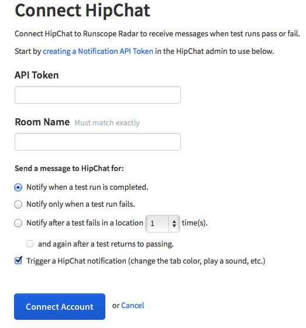
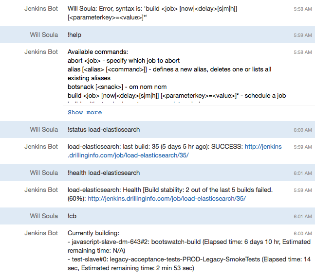
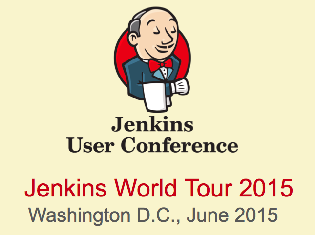

# 
   

 
#Chat Ops and Jenkins
#Will Soula
##Drilling Info
###http://www.drillinginfo.com 
###https://github.com/wsoula 
 
###June 22, 2015

---
What is ChatOps
---
* Definition
    * The process of using a chat room to accomplish
  tasks in a group setting.
* Chat rooms
    * Alerts room
    * Deploys room
    * Departmental room
    * Project/Product room
* Integrations
    * Environment Monitoring - Alert room
    * Business as usual - General Room or Project/Product room
* Chatbot
    * Drive other systems
    * Report from other systems

---
Why ChatOps?
---
* Learning by showing
* Everyone can see what is happening, even on their first day
    * CEO
    * sales
    * support
* React to events as team instead of individually like email
    * was this node supposed to be made?
    * why are snapshots being deployed to production?
* Archive issues or events
* Fix problems from abar

---
Integrations
---

---
Integrations
---
* Github
* Runscope
* Datadog
* Newrelic
* Hipchat
* Jenkins hipchat plugin
* etc.

---
Chatbots - Jenkins
---

---
Chatbots - Jenkins
---
* Instant Messaging Plugin
    * status/health/build/abort/help
    * Build notifications
    * Notify culprits and fixers
    * Backend for many plugins
    * Status shows busy-ness of Jenkins

---
Chatbots - Slackbot
---
* slackbot
    * FIXME: learn more
    * FIXME: about this
    * slash commands
    * built-in to slack

---
Common Features
---
* Open Source
* Help command
* Write Plugins
* Can execute scripts: ruby, bash, etc
* Authorization

---
Chatbots - Hubot
---
* Popularized chat ops
    * Lots of prebuilt scripts
    * Lots of existing help
* Coffeescript
* Chef, puppet, heroku
* Open source
    * Make your own plugins
    * Add new connector
    * Add security
* Connectable
    * slack/hipchat/iMessage/XMPP/etc

---
Chatbots - Lita
---
* Ruby
* Redis
* RSpec
* Connectable
    * slack/hipchat/campfire/etc
* Authorization out of the box

---
Chatbots - Err
---
* Python
* Docstring
* Connectable
    * hipchat/XMPP/Campfire/IRC/tox
* Built in repositories for plugins
* Recall user commands
* Built in security
* Configurable on the fly

---
Jenkins Workflows
---
* Build status notifications
* Build status querying
* Notification of long running builds
* Build sends chat ops commands
    * Cron
    * Timings data
* Kick off builds
    * By user
    * In response to events
    * Jenkins behind firewall

---
Security
---
* Separate auth from commands
* Hubot middleware
* Three Tiers
    * Chatroom authentication
    * Two factor auth
    * Message signatures
* LDAP check for job role
* Approval to separate responsibilities

---
And More...
---
    !text
    give me a cloudformation example (di-specific)
    give me some griddle examples (di-specific)
    how do I delete a jenkins job (di-specific)
    how do I delete the EIS db (di-specific)
    how do I get my <app|api> code into production (di-specific)
    how do I get my code into production (di-specific)
    how do I load the phoenix data (di-specific)
    how do I rsync static layers (di-specific)
    how do I use jenkins job builder (di-specific)
    sparky build preprod (di-specific)
    sparky cleanup newrelic (di-specific)
    sparky cleanup the <app|api> stack numbered <jira ticket> (di-specific)
    sparky cm me <name of card you want created on cm board> (di-specific)
    sparky create deploy ticket <app|api> for <YYYY/MM/DD> date and <YYYY/MM/DD> preprod date and <M.M.P> environment cookbook version (di-specific)
    sparky load <preprod|prod|test|dev> <pdenheaders|pdendetails|wspwells>(di-specific)
    sparky status - Gets the status of sparky (di-specific)
    tell me about 2.0 - Interact with piwik (di-specific)
    tell me about the (dev|test-app|test-api) environment - Get list of stale nodes in environment (di-specific)
    tell me about the <region> region in aws - Tells you about the specified region in the old aws account (di-specific)
    test the <test|preprod|prod> api stack (di-specific)
    what are the DI urls (di-specific)
    what is cm doing (di-specific)
    what is in the next release (walk the project boards) (di-specific)
    what is in the upcoming release (di-specific)
    what is the <attribute> of the <role> role in the <env> environment (di-specific)
    what is the aws url (di-specific)
    what is the ip of the <role> role in the <env> environment (di-specific)
    what is the next release date (di-specific)
    what is the release process (di-specific)
    what nodes are in the <prod app|prod api|preprod app|preprod api|test app|test api|[load balancer name] load balancer (region) - Region is not required if you did not specify a specific load balancer (di-specific)
    what's the chon som menu (di-specific)
    where is the marvel dashboard (di-specific)

---
Thank You
---

