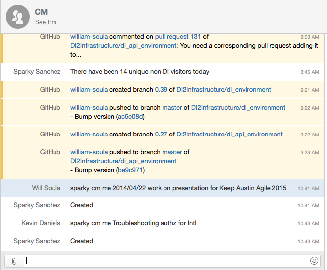
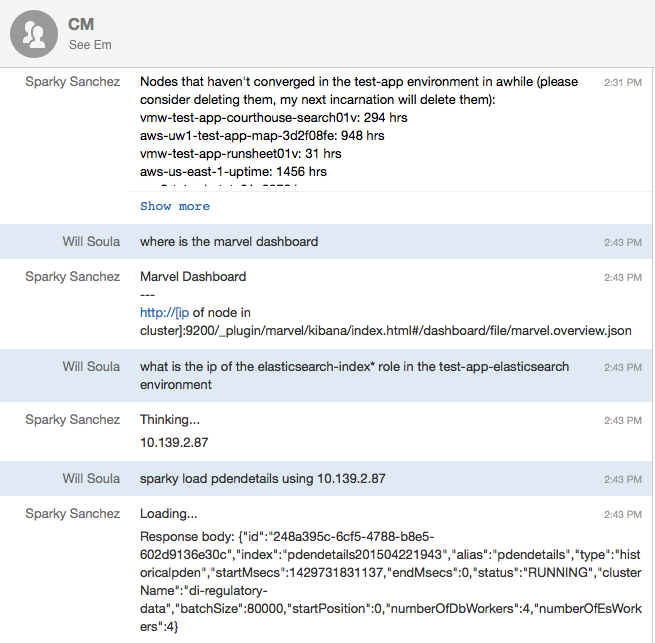

# How to Put Information in the Middle of the Conversation to Bring Teams Together

   

#Will Soula
##Drilling Info  
###http://www.drillinginfo.com 

---
Chat Ops
---

References
* (?) - https://speakerdeck.com/jnewland/chatops-at-github

* What is Chat-Ops and how and why to use it
  

* See how DI uses chat ops everyday
  

* How DI extends hubot and deploys it
  

* Future Plans at DI for chat ops

---
Sparky
---

---
Sparky
---

---
What is Chat-Ops?
---
  

* Interact with systems in chat
  

* Information in the middle of the conversation
  

* Teaching by doing

---
Why Use Chat-Ops?
---
* One place to control all systems
* Alerts cannot be ignored but can be bypassed with ease
* Github presentation
    * Everyone can see what is happening
    * Everyone can see what is happening, on their first day
    * By placing tools directly in the middle of the conversation, everyone is pairing all the time
    * Teaching by doing
    * This was always my main motivation with hubot, teaching by making things visible.  Its an extremely powerful teaching technique
    * hide the ugly
        * put ugly nagios ui behind shiny chatting
---
Why Use Chat-Ops?
---
   

* Interact on mobile
    * can check state of systems on the go
    * possibly fix things remotely
---
How chat ops makes teams more agile
---
* All information gathered from systems in the agile process
    * rally/kanbanery/jira
    * jenkins/travis/teamcity
    * svn/git/cvs
    * datadog/newrelic/uptime
* feedback loop of best practices
    * see what other people are doing
    * help others get better
* increase throughput of work, no waiting
    * instantly see work ready for review
    * catch mistakes earlier
---
Technology Required
---
* Bot
    * hubot
        * interact with anything
        * run anywhere
    * jenkins bot
        * runs in jenkins
        * few, but important, use cases
    * slack
        * slash commands
        * slackbot
    * hipchat
        * hipchat integrations
---
Technology Required
---
* Webhooks
    * github
    * datadog
    * newrelic
    * uptime
    * jenkins
* Chat server/client and room
    * hipchat
    * slack
    * jabber
---
Other uses
---
* Drive code ownership
    * apis written for bot use
* Drive dev engagement with prod
* Possible entry-way to dev ops
---
Other Uses
---
* Shiny toy for people to congregate around
    * engage people bored with getting only "simple" tasks
      * put an api in your work and get info from it to the chat room
      * extend bot to do other tasks or do your tasks for you
  * keep chat rooms in forefront of peoples minds, thus uniting geographically disperse teams
      * pop notifications
      * interesting info
* information delivery
---
What DI Has (Sparky)
---
* prod traffic
    * running count of unique visits a day
* automated test reports
    * runscope periodic runs
* jenkins reporting
    * build failures
    * releases
    * hipchat alert for long running job completion
* dynamic information
    * when is next release date
    * how to release code (gets default branch)
---
What DI Has (Sparky)
---
* fun
    * image me
    * lunch
* documentation
    * gets docs from github
    * same source as the web links
---
What DI Has (Sparky) (Add di_aws and change chon som in hubot)
---

    !text
    give me a cloudformation example (di-specific)
    give me some griddle examples (di-specific)
    how do I delete a jenkins job (di-specific)
    how do I delete the EIS db (di-specific)
    how do I get my <app|api> code into production (di-specific)
    how do I get my code into production (di-specific)
    how do I load the phoenix data (di-specific)
    how do I rsync static layers (di-specific)
    sparky build preprod (di-specific)
    sparky cleanup newrelic (di-specific)
    sparky cleanup the <app|api> stack numbered <jira ticket> (di-specific)
    sparky cm me <name of card you want created on cm board> (di-specific)
    sparky load pdendetails using <ip> (di-specific)
    sparky load pdenheaders using <ip> (di-specific)
    tell me about 2.0 - Interact with piwik (di-specific)
    tell me about the (dev|test-app|test-api) environment - Get list of stale nodes in environment (di-specific)
    test the <test|preprod|prod> api stack (di-specific)
    what is cm doing (di-specific)
    what is in the next release (walk the project boards) (di-specific)
    what is in the upcoming release (di-specific)
    what is the (.*) url (di-specific)
    what is the <attribute> of the <role> role in the <env> environment (di-specific)
    what is the aws url (di-specific)
    what is the ip of the <role> role in the <env> environment (di-specific)
    what is the next release date (di-specific)
    what is the release process (di-specific)
    what is the chon som menu (di-specific)
    where is the marvel dashboard (di-specific)

---
Our Process
---
* most scripts written in coffeescript
* can fall back to bash or ruby etc
* open pull request with changes to hubot
* checkin to master causes cookbook to be uploaded and chef converged
---
Future for DI
---
* deploys (sparky switch production)
* redis for a persistent brain
* gate deploys with interactions with redis brain
* asks people to review/cleanup work
    * review pull request that is old and stale
    * asks to close pull request that is old and stale
    * asks to delete unused nodes/clients/cookbooks/repos/artifacts
